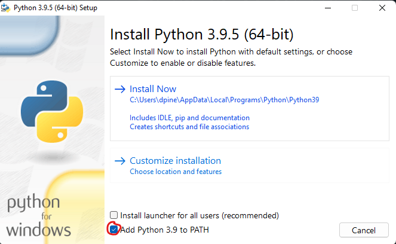
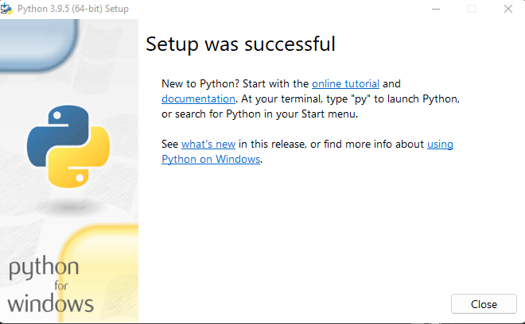
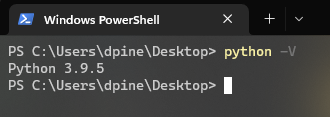
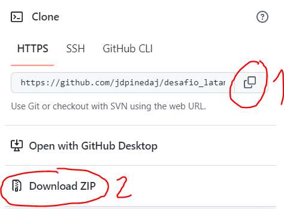

# Desafio LATAM

## Predicción de la probabilidad de atraso de un vuelo con origen Santiago de Chile

Este desafío consiste en predecir la probabilidad de atraso de un vuelo con origen Santiago de Chile y múltiples destinos.
Para mayor información, ver detalles del desafío en el documento [Challenge](https://github.com/jdpinedaj/desafio_latam/blob/master/document/Challenge%20-%20Data%20Scientist.pdf).

## Setup

### Windows setup

- Descarga Python de https://www.python.org/, se recomienda usar una de las versiones más estables (3.7.3, 3.8.10, 3.9.5), click [aquí](https://www.python.org/ftp/python/3.9.5/python-3.9.5-amd64.exe) para descargar.
- Ejecute el archivo .exe

  

- Dale click a `Add Python 3.9 to PATH` y luego a `Install Now`
- Cuando la instalación termine correctamente, deberás ver la siguiente pantalla:

  

- Abra una ventana de PowerShell y presione `Shift + right click` en cualquier carpeta o la pantalla de escritorio.

  

- Si escribe `python -V` en la consola, deberás ver la siguiente salida:

  

- Instala pipenv que es necesario para crear virtual environments, más información [aquí](https://pipenv.pypa.io/en/latest/) escribiendo `pip install pipenv` en la consola.

### Project Setup

- Descarga el repositorio usando git o como un archivo zip como se muestra a continuación:
  - Alternativa 1: git: si estás familiarizado con git, simplemente copia el https path aquí y en powershell corre `git clone https://github.com/jdpinedaj/desafio_latam.git`. Puedes leer más sobre git [aquí](https://git-scm.com/).
  - Alternativa 2: zip: Simplemente dale click a `Download ZIP` y descomprime los archivos.

- Abre una consola en la raíz del proyecto, y corre:
  - `pipenv shell`
  - `pipenv install`

### 2. Correr la solución

Para ver la solución, debes revisar el siguiente [jupyter notebook](https://github.com/jdpinedaj/desafio_latam/tree/master/notebooks)

### 3. GitHub Actions

Si estás familiarizado con GitHub Actions, puedes triggear la ejecucion del jupyter desde Actions (actualmente está configurado para que se ejecute una vez mensual). Este procedimiento correrá nuevamente el notebook y guardará una nueva versión del modelo en el repositorio.
